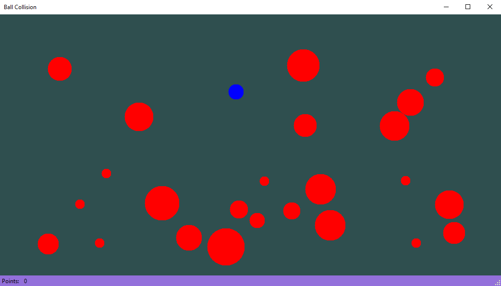

<h1  align="center">Ball Game with collision detection</h1>

  

<b>This windows form game was developted in c# using windows forms .net framework.  
This file fully describes the game, how should it be played and the logic behind it.</b>  
This game uses a collision detection logic using the Distance Formula between two points that is derived from the Pythagorean Theorem.

<h2> GAME BASICS </h2>

  The main purpose of this game is to score the most points before you collide with a ball that is bigger than you.
  Upon starting the application in the window, random number of balls are generated between the range of 20 and 35 placing them in such a way that collision is not possible.
  The ball size (radius) is generated randomly from the range of 10 to 40.

<h2> HOW TO PLAY </h2>

<ol>
  <li>Upon starting the player can click at random empty location to spawn his player ball. The player ball is with the color blue.</li>
  <li>The player can move it's blue ball using the keyboard keys: <b> W S A D </b>. </li>
  <li>If the player comes in collision with a smaller or equal ball to his, the player's ball increases in size by 30% of the collided ball.</li>
  <li>If the player comes in collision with a bigger ball than his, the player's ball is taken by the bigger ball and the game ends.</li>
  <li>Every 3 seconds the player's ball decreases by 2 at least and 15 at most, depending on the player's ball size.</li>
  <li>If the ball shirinks to size 0, the game ends.</li>
  <li>Random small balls are being generated every 5 seconds, and random number of balls are added to the scene when less than 5 balls left.</li>
</ol>

Developed by: Angel Petrushevski ©

